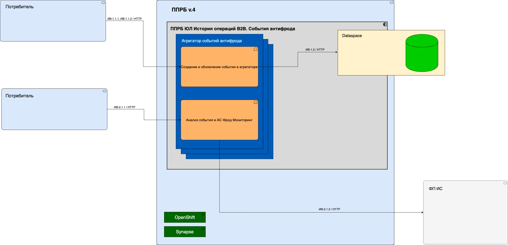

== Архитектура сервиса

=== Схема взаимодействия компонентов фабрики

Фабрика представляет собой деплоймент, набор ingress/egress и платформенные компоненты Dataspace Core и Dataspace
Gigabas.

* Фабрика обращается в БД через платформенный компонент Dataspace Core
* Репликация в базу SI осуществляется платформенным компонентом Dataspace Gigabas
* Фабрика обращается в ФП ИС для анализа событий в АС Фрод Мониторинг
