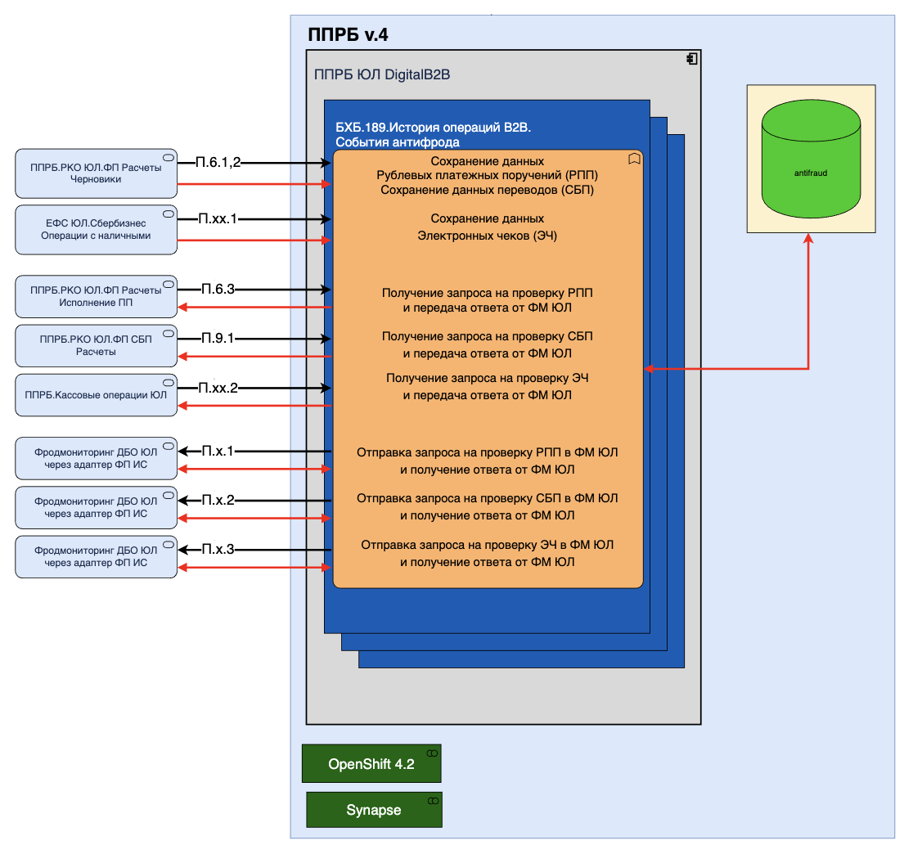

== Архитектура сервиса

=== Схема взаимодействия компонентов фабрики

Фабрика представляет собой единый деплоймент (кроме ingress/egress), который обслуживает клиентские запросы и занимается
репликацией данных в базу SI.

* Фабрика обращается в БД напрямую
* Фабрика при коммите отправляет сообщение в Kafka прикладного журнала (через платформенную библиотеку
HibernateSE)
* Фабрика подписывается на топики Kafka прикладного журнала и выполняет репликацию в базу SI
* Фабрика обращается в ФП ИС для анализа событий в АС Фрод Мониторинг
